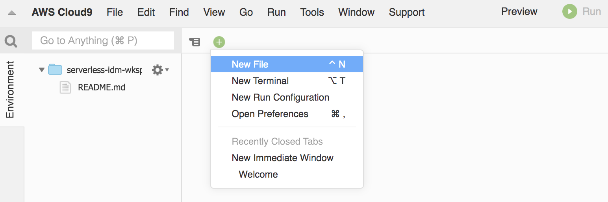
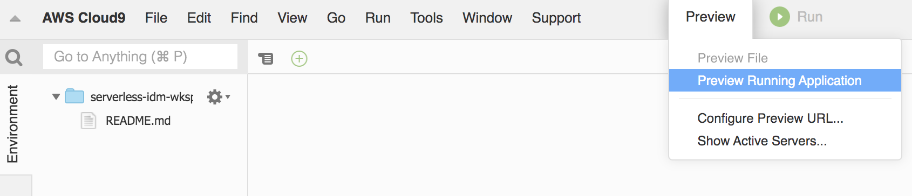
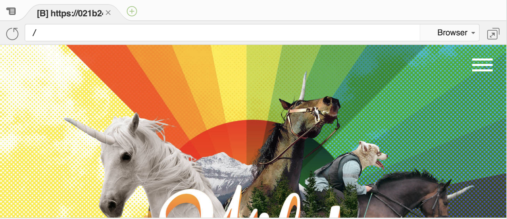

# Module 0 <small>Environment setup</small>

**Time**: 10 minutes

This section outlines the prerequisites to complete the workshop and instructions for launching a Cloud9 IDE environment that you will use throughout the remaining modules.

## Setup your AWS Cloud9 IDE

To setup your environment please expand **one** of the following dropdown sections (depending on how you're doing this workshop) and follow the instructions: 

??? info  "Click here if you're at an AWS event where Event Engine is being used:"
	
	1. Navigate to the <a href="https://dashboard.eventengine.run" target="_blank">Event Engine dashboard</a>
	2. Enter the **team hash** code that was distributed to you by the instructors.
	3. Click **AWS Console**.  The CloudFormation template for this round has already been prerun.

??? info  "Click here if you're running this individually in your own AWS Account:"
    **Launch the AWS CloudFormation Stack**

    In this section you will launch a CloudFormation stack that will create a a new [Amazon VPC](https://aws.amazon.com/vpc/) environment and a [Cloud9 IDE](https://aws.amazon.com/cloud9/) Instance that you will use for the rest of the workshop.

    Region| Deploy
    ------|-----
     N. Virginia (us-east-1) | <a href="https://console.aws.amazon.com/cloudformation/home?region=us-east-1#/stacks/new?stackName=serverless-idm-cloud9&templateURL=https://sa-security-specialist-workshops-us-east-1.s3.amazonaws.com/serverless-idm/env-setup.yaml" target="_blank"></a>
     Ohio (us-east-2) | <a href="https://console.aws.amazon.com/cloudformation/home?region=us-east-2#/stacks/new?stackName=serverless-idm-cloud9&templateURL=https://sa-security-specialist-workshops-us-east-2.s3.us-east-2.amazonaws.com/serverless-idm/env-setup.yaml" target="_blank">
     Oregon (us-west-2) | <a href="https://console.aws.amazon.com/cloudformation/home?region=us-west-2#/stacks/new?stackName=serverless-idm-cloud9&templateURL=https://sa-security-specialist-workshops-us-west-2.s3-us-west-2.amazonaws.com/serverless-idm/env-setup.yaml" target="_blank">

    1. Click the **Deploy to AWS** button above.  This will automatically take you to the console to run the template.

    2. The **Specify an Amazon S3 template URL** is already selected and the template URL is automatically added.  Click **Next**.

    3. On the **Specify Details** click **Next** (leave defaults). 
	
    4. On the **Options** click **Next** \(leave everything on this page as the default\).

    5. On the Review page click the checkbox to **acknowledge IAM capabilities** and then click **Create stack**.
    6. Choose the **Stack Info** tab to go to the overall stack status page and wait until the stack is fully launched and shows a status of *CREATE_COMPLETE*. Click the refresh icon periodically to see progress update.  The stack will take a couple minutes to complete.

## Browse to your AWS Cloud9 IDE

<a href="https://aws.amazon.com/cloud9/" target="_blank">AWS Cloud9</a> is a cloud-based integrated development environment (IDE) that lets you write, run, and debug your code with just a browser. It includes a code editor, debugger, and terminal. Cloud9 comes pre-packaged with essential tools for popular programming languages and the AWS Command Line Interface (CLI) pre-installed so you don’t need to install files or configure your laptop for this workshop. 

1. Open the <a href="https://console.aws.amazon.com/cloud9/home?" target="_blank">AWS Cloud9</a> console.

2. Click **Open IDE** on the **serverless-idm-wksp-ide** environment.

!!! warning "Keep your AWS Cloud9 IDE opened in a tab"
    You will be using your IDE throughout the entirety of this workshop so be sure to always have a tab open.

## Create a scratch pad
Keep a scratch pad in Cloud9 or a text editor on your local computer for notes.  When the step-by-step directions tell you to note something such as an ID or Amazon Resource Name (ARN), copy and paste that into the scratch pad tab.

1. Within Cloud9, click the **+** symbol and choose to create **New File**. You will use this new blank editor tab as a scratchpad for various resource names and variables.

    


## Download your workshop code

1. Run the following command to download your application code:

```
git clone https://github.com/aws-samples/amazon-cognito-identity-management-workshop.git
```

## Initialize your developer workspace

Run the following commands to install the yarn package manager and website dependencies:

```
npm install -g yarn
cd ~/environment/amazon-cognito-identity-management-workshop/website/
yarn install
```

## Run the website locally

1. Run the following command to start the local web server:

    ```
    yarn start
    ```

    !!! warning "Wait for the development server to start"
         You can ignore any message saying *Compiled with warnings* as we will resolve these warnings as we add our functionality to the application."


2. Now that the development server has started, click **Preview Running Application** in the top of the screen next to the Run button.

      

3. The web application will load in a small window next to the terminal at the bottom of the Cloud9 IDE. Click the **re-size button** next to the word **Browser** to open this window in a new tab.

       

   As you make changes to the web application, this tab will automatically refresh to reflect your changes. Leave this tab open and return to the Cloud9 IDE tab to continue the workshop.

!!! warning "Website is not fully functional yet"
    Though the Wild Rydes website may look functional, there is currently no integration for sign-up or sign-in requests to go anywhere.

---

After you have successfully setup your environment, you can proceed to the next module.