# Module 1 <small>User flows configuration</small>

**Time**: 40 minutes

In this module, you will create an Amazon Cognito User Pool and Identity Pool for the Wild Rydes application. The Cognito User Pool will store user profile information and provide sign-up and sign-in capabilities, with the Cognito Identity Pool providing the ability to assume an Identity and Access Management (IAM) role from within the application.

Since Wild Rydes is a ride sharing application, a key requirement is that all users must sign-up and sign-in before they're allowed to request a ride. You will configure the application to integrate with <a href="https://aws.amazon.com/cognito/" target="_blank">Amazon Cognito</a> for these purposes via the <a href="https://aws-amplify.github.io/" target="_blank">AWS Amplify</a> JavaScript library.

## Architecture

For this module, we will be creating a Cognito User Pool as our secure user directory then configuring our application to use the AWS Amplify library to easily integrate Amazon Cognito into our application.  You will also configure a number of Lambda Triggers to further customize the user flows.  Below is a sequence diagram to show the interactions with the different components of this module.

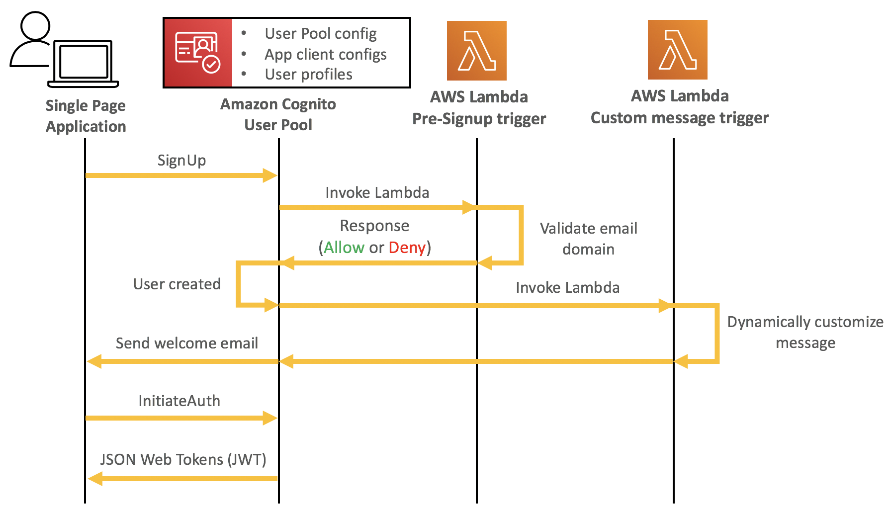

## Create a Cognito User Pool

Amazon Cognito User Pools lets you add user sign-up and sign-in capabilities to your web and mobile apps quickly and easily. In this step, we'll create a Cognito user pool for our Wild Rydes app.

1. Open the <a href="https://console.aws.amazon.com/cognito/home?" target="_blank">Amazon Cognito</a> console.

3. Choose **Manage User Pools**.

4. Choose **Create a User Pool** in the top right of the console.

5. Provide a name for your user pool such as **WildRydes**.

6. Choose **Step through settings** to configure our user pool options.

	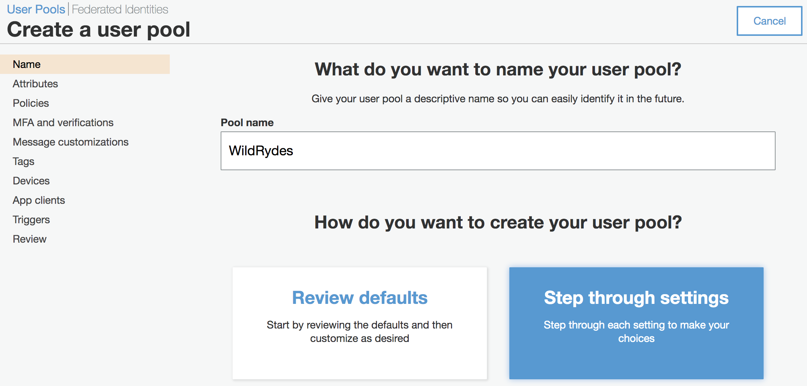

7. **Attributes**: Leave **Username** selected, but additionally select the following:
        
    * *Also allow sign in with verified email address*
    * *Also allow sign in with verified phone number*

    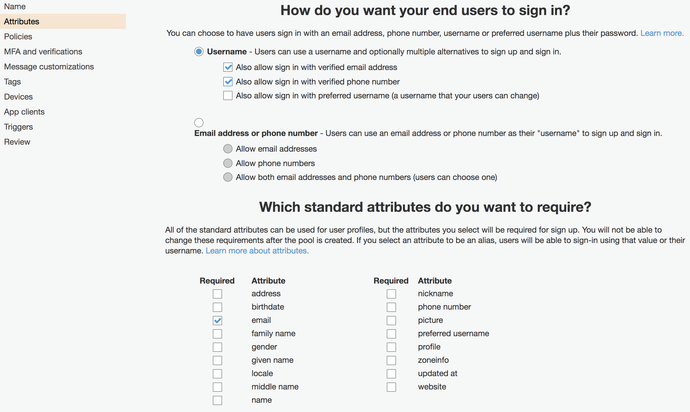

8. **Attributes**: Add a custom attribute for **genre** that is mutable.  This attribute is to give the Unicorn an idea of the riders favorite music genre. Then choose **Next step**.

    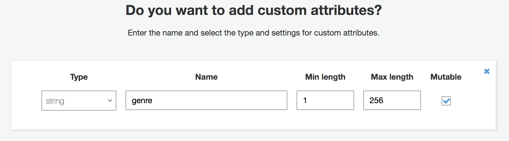

    !!! info "User Pool Attributes"
        Cognito User Pools have a standard set of attributes available for all users in the pool.  These are implemented following the <a href="https://openid.net/specs/openid-connect-core-1_0.html#StandardClaims" target="_blank">OpenID Connect specification</a>.  You can also optionally create up to 25 custom attributes to match any unique claims requirements you may have for your applications.

10. **Policies**: Leave password policies and user sign up settings set to default settings and choose **Next step**.

	<!--  -->

11. **MFA and verifications**: Leave the default settings for MFA and email verification and choose **Next step**.

12. **Message customizations**: Leave the default for message and SES defaults and choose **Next step**.

15. **Tags**: Skip adding any tags and click **Next step**.

16. **Devices**: Choose **No** to not remember your user's devices then click **Next step**.

17. **App clients**: In the next screen, click the **Add an app client** *link*.

18. **App clients**: Input **wildrydes-web-app** as the app client name.

19. **App clients**: Uncheck the following:
    *  *Set the expiration of the identity and access tokens to 45 minutes*
    *  *Generate client secret*
    *  *Enable SRP protocol based authentication*. 

    !!! info "App client settings"
        **Token expiration customization** - Each token expiration can be customized per your application design requirements.

        **Client secrets** - These are known only to your application and the authorization server. They are used for server-side applications authentication and are not needed for JavaScript applications.  They are also are not compatible with the Amplify JS SDK since it's a client library.

        **Auth flows configuration** - These authentication flows are all specific to the <a href="https://docs.aws.amazon.com/cognito/latest/developerguide/amazon-cognito-user-pools-authentication-flow.html" target="_blank">Amazon Cognito APIs</a>, **not** the OAuth flows made available through the hosted Cognito authorization server.


    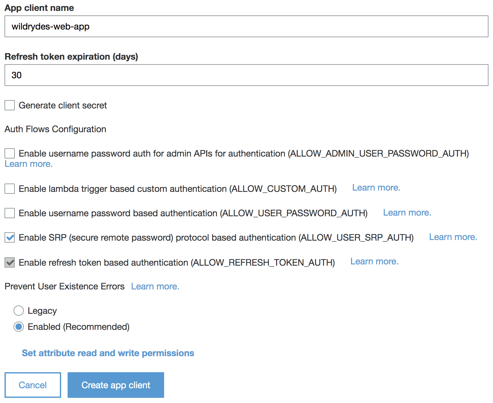

20. **App clients**: Choose **Create app client** and click **Next step**.

22. **Triggers**: Leave all Lambda trigger settings set to *none* and choose **Next step**. 

    !!! info "Lambda Triggers"
        These trigger settings allow you to extend the out-of-the-box sign-up and sign-in flows with your own custom logic.  You can add authentication challenges, migrate users, and customize verification messages.  The optional extensions at the end of this module will walk through configuring a variety of Lambda triggers. 

24. Review summary of all provided settings for accuracy then choose **Create pool**.

!!! note "Copy to scratch pad"
    In the AWS Cognito console, copy your new **User Pool Id**: 

    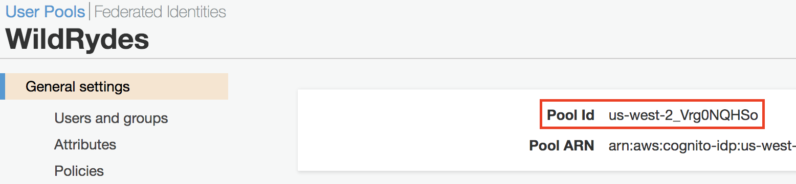

    And your **App client ID**:

    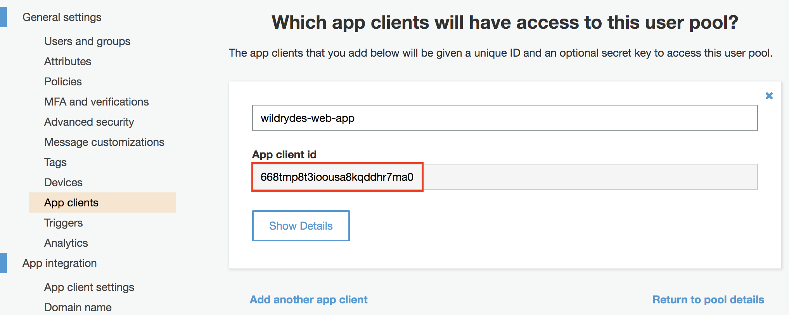

## Create a Cognito Identity Pool

Cognito Identity Pools are used to provide AWS credentials via IAM roles to end-user applications. Since we'll be integrating our Cognito deployment and users with other AWS services, we'll go ahead and create this identity pool now.

You will need to create a Cognito Identity Pool linked to the Cognito User Pool and app client ID you just created. Your application will not require un-authenticated users to access any AWS resources, so you do not need to enable access to unauthenticated identities. 

1. In the Cognito console, choose **Federated Identities** in the header bar (top left) to switch to the console for Cognito Federated Identities.

1. Choose **Create new Identity pool**.

1. Input **wildrydes_identity_pool** as the Identity pool name.

1. Expand **Authentication providers**.

1. Within the Cognito tab, input the **User Pool ID** and **App client ID** you copied previously to the scratchpad tab.

	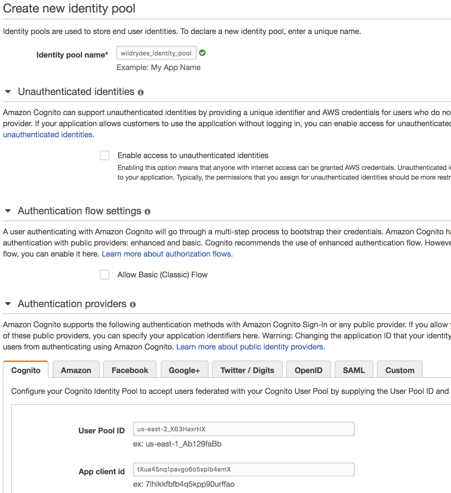

1. Choose **Create Pool**.

1. Choose **Allow** to allow Cognito Identity Pools to setup IAM roles for your application's users. Permissions and settings of these roles can be customized later.

    !!! info "Identity pools AWS IAM Roles"
        When you first configure a Cognito identity pool, it will automatically create two AWS IAM Roles on your behalf.  One for authenticated users and a second for unauthenticated users.  You can also optionally define rules to choose different roles for each user based on claims in the user's ID token.

!!! note "Copy to scratch pad"
    Copy the identity pool ID to your scratch pad:

    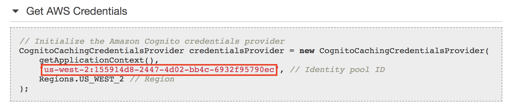
	
    Your scratchpad should now have values for the following Cognito resources:

	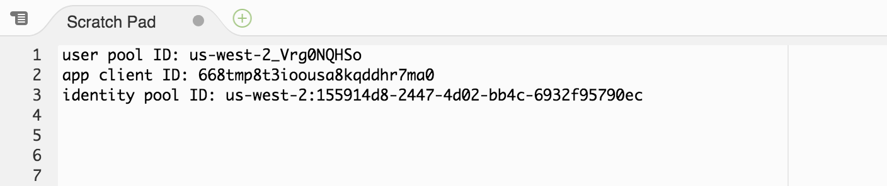

## Integrate your application with Amazon Cognito

Now that you've created and configured your Cognito User Pool and Identity Pool, you need to configure your application to integrate to Amazon Cognito so it can store user profiles and enable sign-up and sign-in.

You will import the <a href="https://aws-amplify.github.io/" target="_blank">AWS Amplify</a> JavaScript library into the project then add sign-up and sign-in utility classes to integrate with our existing UI and front-end components.

Before using any AWS Amplify modules, you first need to configure Amplify to use your newly created Cognito resources.

1. Open **/website/src/amplify-config.js** in your Cloud9 IDE editor.

1. Copy the following parameter values from your previous scratchpad into the config value parameter placeholders under **Auth**:
	- `identityPoolId`
	- `region`
	- `userPoolId`
	- `userPoolWebClientId (App Client ID)`

1. **Save your changes** to the Amplify config file so your new  settings take effect. 


    !!! warning "Unsaved changes"
        Any unsaved changes to a file are indicated by a dot icon in the tab of the editor so if you see a gray dot next to the file name, you may have forgotten to save.

1. Next, edit the **website/src/index.js** file to add the following lines to the **top of the file** **(but below all the other imports)** to configure Amplify then save your changes:

```javascript
import Amplify from 'aws-amplify';
import awsConfig from './amplify-config';

Amplify.configure(awsConfig);
```
	
After making this changes, your imports should be in the following order:
	
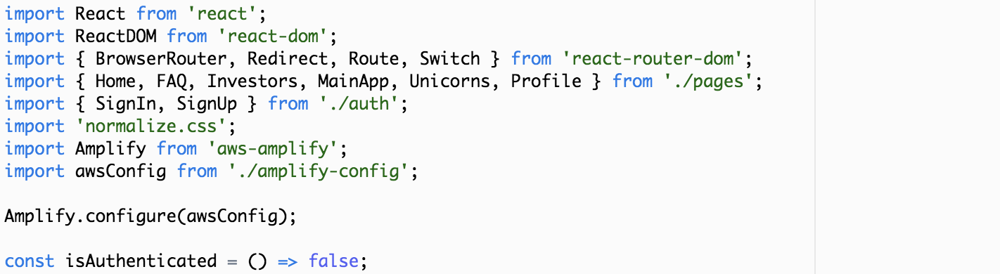
	
**Save your changes** to the *website/src/index.js* file.

Next, we need to ensure our application evaluates the user's authenticated state. 

1. In the same **/website/src/index.js** file, find and replace the **isAuthenticated method** with the code below to use our Amplify library's built-in user session to check this status.

```javascript
const isAuthenticated = () => Amplify.Auth.user !== null;
```

**Save your changes** to the */website/src/index.js* file.

Now that we've imported Amplify and configured the Amplify library, we need to update our application's code to sign-up users using Amplify and Cognito User Pools by finding and replacing the following methods within the **/website/src/auth/SignUp.js** file with the following code.

!!! tip     "Only replace the following two methods. The rest of the SignUp.js file should not be modified"
	The **onSubmitForm** method handles the event when the registration form is submitted. This calls the Auth.signUp method from the AWS Amplify library which registers the user with your Cognito User Pool.
	
	The **onSubmitVerification** method handles the event when the verification code entry form is submitted after the initial registration request. This calls the Auth.confirmSignUp method from the AWS Amplify library which confirms the user registration within your Cognito User Pool.

```javascript
async onSubmitForm(e) {
    e.preventDefault();
    try {
        const params = {
            username: this.state.email.replace(/[@.]/g, '|'),
            password: this.state.password,
            attributes: {
                email: this.state.email,
                phone_number: this.state.phone,
                'custom:genre': this.state.genre
            },
            validationData: []
        };
        const data = await Auth.signUp(params);
        console.log(data);
        this.setState({ stage: 1 });
    } catch (err) {
    if (err === "No userPool") {
        // User pool not defined in Amplify config file
        console.error("User Pool not defined");
        alert("User Pool not defined. Amplify config must be updated with user pool config");
    } else if (err.message === "User already exists") {
        // Setting state to allow user to proceed to enter verification code
        this.setState({ stage: 1 });
    } else {
        if (err.message.indexOf("phone number format") >= 0) {err.message = "Invalid phone number format. Must include country code. Example: +14252345678"}
        alert(err.message);
        console.error("Exception from Auth.signUp: ", err);
        this.setState({ stage: 0, email: '', password: '', confirm: '' });
    }
    }
}

async onSubmitVerification(e) {
    e.preventDefault();
    try {
        const data = await Auth.confirmSignUp(
            this.state.email.replace(/[@.]/g, '|'),
            this.state.code
        );
        console.log(data);
        // Go to the sign in page
        this.props.history.replace('/signin');
    } catch (err) {
        alert(err.message);
        console.error("Exception from Auth.confirmSignUp: ", err);
    }
}
```
**Save your changes** to the */website/src/auth/SignUp.js* file.

You additionally need to integrate the sign-in capability to use AWS Amplify and Cognito by finding and replacing the following methods within the **/website/src/auth/SignIn.js** file with the code below.

!!! tip     "You only need to the following two methods. The rest of the SignIn.js file should not be modified."
	The **onSubmitForm** method initiates the signin request with your Cognito User Pool by invoking the Auth.signIn method from AWS Amplify then sets the local state appropriately to indicate the user has signed in successfully.
	
	The **onSubmitVerification** method is used to submit a verification code whenever multi-factor authentication is required to authenticate. For this workshop, this method will not be invoked since you did not require multi-factor authentication earlier when configuring your Cognito User Pool.  

```javascript
async onSubmitForm(e) {
    e.preventDefault();
    try {
        const userObject = await Auth.signIn(
            this.state.email.replace(/[@.]/g, '|'),
            this.state.password
        );
        console.log('userObject', userObject);
        if (userObject.challengeName) {
            // Auth challenges are pending prior to token issuance
            this.setState({ userObject, stage: 1 });
        } else {
            // No remaining auth challenges need to be satisfied
            const session = await Auth.currentSession();
            // console.log('Cognito User Access Token:', session.getAccessToken().getJwtToken());
            console.log('Cognito User Identity Token:', session.getIdToken().getJwtToken());
            // console.log('Cognito User Refresh Token', session.getRefreshToken().getToken());
            this.setState({ stage: 0, email: '', password: '', code: '' });
            this.props.history.replace('/app');
        }
    } catch (err) {
        alert(err.message);
        console.error('Auth.signIn(): ', err);
    }
}

async onSubmitVerification(e) {
    e.preventDefault();
    try {
        const data = await Auth.confirmSignIn(
        this.state.userObject,
        this.state.code
        );
        console.log('Cognito User Data:', data);
        const session = await Auth.currentSession();
        // console.log('Cognito User Access Token:', session.getAccessToken().getJwtToken());
        console.log('Cognito User Identity Token:', session.getIdToken().getJwtToken());
        // console.log('Cognito User Refresh Token', session.getRefreshToken().getToken());
        this.setState({ stage: 0, email: '', password: '', code: '' });
        this.props.history.replace('/app');
    } catch (err) {
        alert(err.message);
        console.error('Auth.confirmSignIn(): ', err);
    }
}
```
**Save your changes** to the */website/src/auth/SignIn.js* file.

## Validate sign-up and sign-in

Now that you have integrated our Amplify code into our application, you need to test the site to see that authentication is working end-to-end.

Return to your browser tab where you started your Wild Rydes application earlier after popping out from the Cloud9 IDE once in preview mode. This page automatically refreshes after you save any code changes so should now reflect all of your changes and be ready for testing.

1. Click on the **Apply** link in the menu at the top right (or visit the `/register` path) of your Cloud9's website to go to the registration page.

1. Input the following: 
     * **e-mail address** (needs to be a valid email address since you'll need to verify your account), 
     * **phone number** with `+country_code` first preceeding the number (use a sample phone number such as `+1234555010`)
     * **favorite genre** (e.g. `jazz`, `blues`, `classical`, etc.)
     * **password** twice (Your password must include 8 characters, including uppercase and lowercase characters, and at least 1 number and 1 special character.)

1. Choose **Let's Ryde** to submit registration.

1. On the verify e-mail screen, enter the one-time code sent to your e-mail address provided then choose **Verify**.

	!!! tip     "Be sure to check your spam folder for the e-mail with your verification code if you do not see it in your inbox."

1. Assuming no errors were encountered, you will be redirected to the Sign-in screen. Now, re-enter the same e-mail address and password you chose at registration.

1. If the page then loads a map, sign-in was successful and you have successfully integrated Cognito for app authentication.

1. Scroll down beyond the map to copy your user's identity token and decode it by pasting it into the 'encoded' input box at <a href="http://jwt.io" target="_blank">JWT.io</a>. You will see all of your user's attributes are encoded within the token, along with other standard attributes such as the time the token was issued, the time the token expires, the user's unique ID, and more.

## End of Module 1

Once you have finished setting up the user authentication please wait for the instructions from the presenter to move on to the next module (unless you're running this on your own).

---

## Optional extensions

If you've finished Module 1 early and would like to further customize the user sign up experience, feel free to run through any of the extensions below:

* **Extension 1**: [Lambda triggers](./01-user-auth-triggers.md)